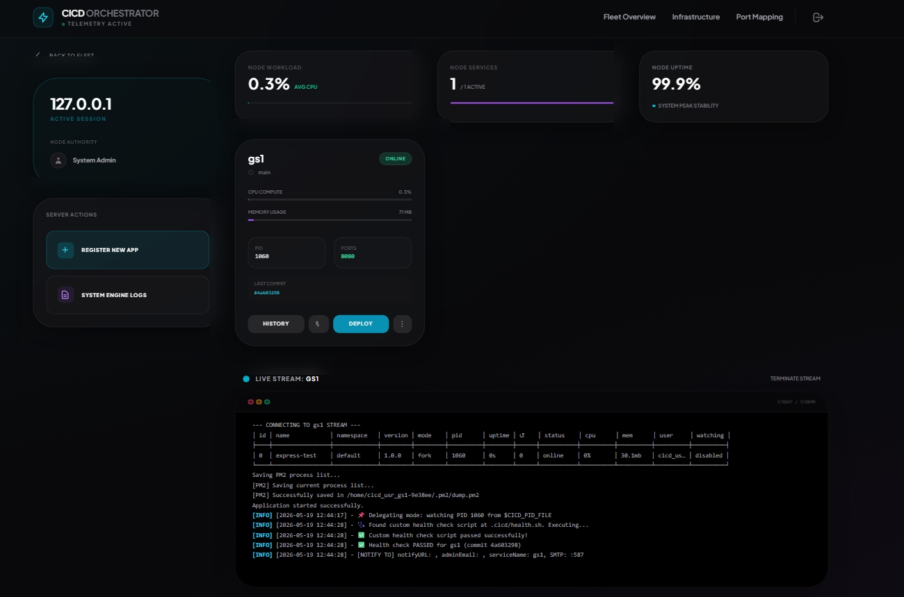
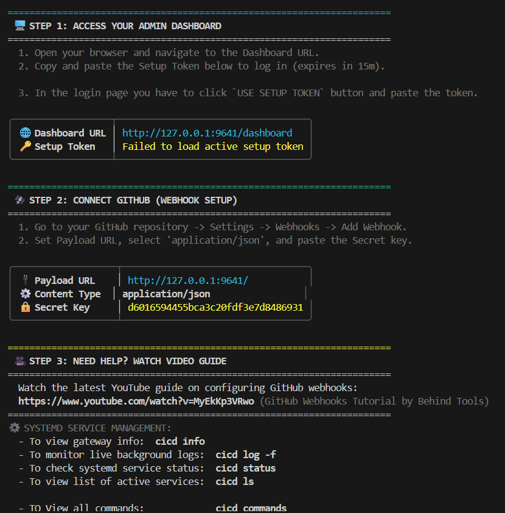

# CICD

[](https://github.com/KTBsomen/cicd/releases)
[](https://github.com/KTBsomen/cicd/blob/main/LICENSE)
[](https://cicd.rf.gd)

A lightweight self-hosted deployment orchestrator for VPS and bare-metal servers.

Push to GitHub. CICD automatically pulls, builds, and deploys your applications using your own shell scripts.

No Kubernetes. No YAML pipelines. No Docker required.

---

## Why CICD instead of custom SSH scripts?

Most developers deploying to a VPS currently manage deployments using manual SSH steps or custom cron scripts:

```bash
ssh user@server "cd /var/www/app && git pull && npm install && pm2 restart app"
```

While this works initially, custom SSH deployment scripts quickly break down as your server grows:
* They offer no visual state or active log streaming.
* SSH keys with excessive privileges are often exposed.
* A single failed step (like a broken dependency compilation) can crash your live server with no option for automated rollbacks.

CICD automates this exact workflow safely. It does not replace your existing deployment scripts, it wraps them in a lightweight runtime that triggers automatically on git push, handles unprivileged execution switches, and logs everything to a real-time console.

---

## Core Advantages

* **Direct Host OS Execution**: Your applications run natively on the host server. Node.js, PM2, Python virtualenv, Go, and PHP run directly on bare metal with zero container network bridging overhead, virtual disk latency, or virtualization RAM tax.
* **Isolated Linux Users**: Security is managed through native operating system privileges. Each project is assigned its own unprivileged system user. All deployment scripts execute under this user, ensuring code never gains root access to your core infrastructure.
* **Minimal Runtime Requirements**: Written in Go, CICD compiles down to a single static binary. It runs as a systemd service, consumes less than 15 MB of RAM under load, and only requires standard system packages (curl, git, and systemd) to operate.

---

## Architectural Flow

```
[ Developer Workspace ] 
        │
        ▼ (git push)
[ GitHub / GitLab Repository ] ── (Signature-Validated Webhook) ──┐
                                                                  ▼
                                                   [ CICD Webhook Listener ]
                                                   (Default Port: 9641)
                                                                  │
                                                                  ▼
                                                   [ Unprivileged Task Runner ]
                                                   (Linux privilege switch)
                                                                  │
                                           ┌──────────────────────┴──────────────────────┐
                                           ▼                                             ▼
                                 [ .cicd/install.sh ]                           [ .cicd/run.sh ]
                              (Runs only on dependency changes)              (Runs on every commit)
                                           │                                             │
                                           ▼                                             ▼
                               [ Native Host Runtimes ]                        [ Production App Service ]
                               (Node, Python, Go, PHP, etc.)                 (PM2, Systemd, tmux, etc.)
```

---

## Interface Mockups

### Web Dashboard Overview



*The real-time Server-Sent Events metrics dashboard showing active server resources, live task pipelines, and project control dials.*

### Setup Console



*The initial terminal bootstrap showing configuration ports, webhook keys, and administrative login URLs.*

### Real-Time Dashboard Mockup (SSE Streamed Telemetry)

The orchestrator includes a unified visual interface streaming real-time statistics directly from your server:

```
┌────────────────────────────────────────────────────────────────────────┐
│  CICD Fleet Commander                                 [ Uptime: 9d 4h ]│
├────────────────────────────────────────────────────────────────────────┤
│                                                                        │
│  [ CPU Usage ]               [ Memory Usage ]           [ Active Ports ]│
│  ████░░░░░░░░  28.4%         ████████░░░░  61.2%        9641, 3000, 8080│
│                                                                        │
├────────────────────────────────────────────────────────────────────────┤
│  Active Services                                                       │
├────────────────────────────────────────────────────────────────────────┤
│  ● node-app     [Port 3000]   Active    commit: 9f8a3c2   Uptime: 2d   │
│  ● python-api   [Port 8080]   Active    commit: 2b4c1d8   Uptime: 5d   │
│  ● static-spa   [Static SPA]  Active    commit: c7a9e5b   Uptime: 9d   │
│                                                                        │
├────────────────────────────────────────────────────────────────────────┤
│  Live Deployment Console (nodejs-app)                                  │
├────────────────────────────────────────────────────────────────────────┤
│  [14:10:02] Fetching updates from branch: main                         │
│  [14:10:03] Detected change in package.json, executing install.sh...   │
│  [14:10:05] npm install completed successfully.                        │
│  [14:10:06] Executing run.sh: pm2 trigger reload                       │
│  [14:10:07] Health Check Passed: HTTP 200 on port 3000                 │
│  [14:10:07] Status: SUCCESS. Deployment Completed.                     │
└────────────────────────────────────────────────────────────────────────┘
```

---

## Quick Start Setup

### 1. Download and Install
Run the universal installation script on your server:

```bash
curl -fsSL https://cicd.rf.gd/install.sh | sh
```

### 2. Start the Daemon
Boot the continuous orchestrator service:

```bash
sudo ./cicd
```

Copy the unique authorization setup token printed in the console stdout to log in to the dashboard at `http://your-server-ip:9641/dashboard`.

---

## Project Configuration

To configure a project, register it visually through the dashboard or pass your parameters directly via CLI flags on daemon startup:

```bash
sudo ./cicd \
  --repo-url https://github.com/your-username/your-app \
  --branch main \
  --webhook 9641 \
  --webhook-secret your-hmac-secret \
  --admin-email admin@your-domain.com \
  --notify-url https://hooks.slack.com/services/your-slack-endpoint
```

### Private Repository Access (PAT)
For private git repositories, generate a fine-grained token under your [GitHub Personal Access Token Settings](https://github.com/settings/personal-access-tokens). Specify read-only permissions for the **Contents** category under Repository permissions, and enter this token as your git password during project registration.

### Secure Webhooks Setup
Register a webhook under your repository settings page:
* **Payload URL**: `http://YOUR-SERVER-PUBLIC-IP:9641/` (ensure the trailing slash is included)
* **Content Type**: `application/json`
* **Secret**: The HMAC secret key configured during project setup.
* **Events**: select push events only.

---

## Script Architecture (.cicd Folder)

Add a `.cicd` folder to your project root containing three execution hooks:

### install.sh
This script is cached automatically by the runner and only runs when its file content changes (e.g. dependency upgrades). Used to fetch runtime libraries:
```bash
#!/bin/bash
# Install required modules
npm install --production
```

### run.sh
Runs on every successful commit pull to compile assets and start your native service:
```bash
#!/bin/bash
# Compile and trigger native execution
npm run build
pm2 restart my-app || pm2 start dist/main.js --name my-app
```

### health.sh
Runs every 30 seconds to verify deployment health. If this script exits with a non-zero status code, CICD automatically rolls back your environment to the last stable commit:
```bash
#!/bin/bash
# Ping the app port
curl -f http://localhost:3000/health || exit 1
```

---

## Documentation Index

The complete user documentation is hosted at [https://cicd.rf.gd](https://cicd.rf.gd):

* [Quick Start Guide](https://cicd.rf.gd/quickstart.html): Network port setup, service registrations, and daemon checks.
* [The .cicd Folder Guide](https://cicd.rf.gd/cicd-folder.html): Deployment templates for Node.js, PM2, Python Flask, Go services, React SPA, and Docker Compose.
* [Architecture Deep Dive](https://cicd.rf.gd/architecture.html): Privilege switching, SQLite database tables, and fleet sync configurations.
* [CLI Reference](https://cicd.rf.gd/cli-reference.html): Daemon signals and management commands.
* [Troubleshooting Hub](https://cicd.rf.gd/troubleshooting.html): Resolving UFW rules, permission errors, and systemd issues.

---

## License

This project is licensed under the MIT License: see the [LICENSE](LICENSE) file for details.